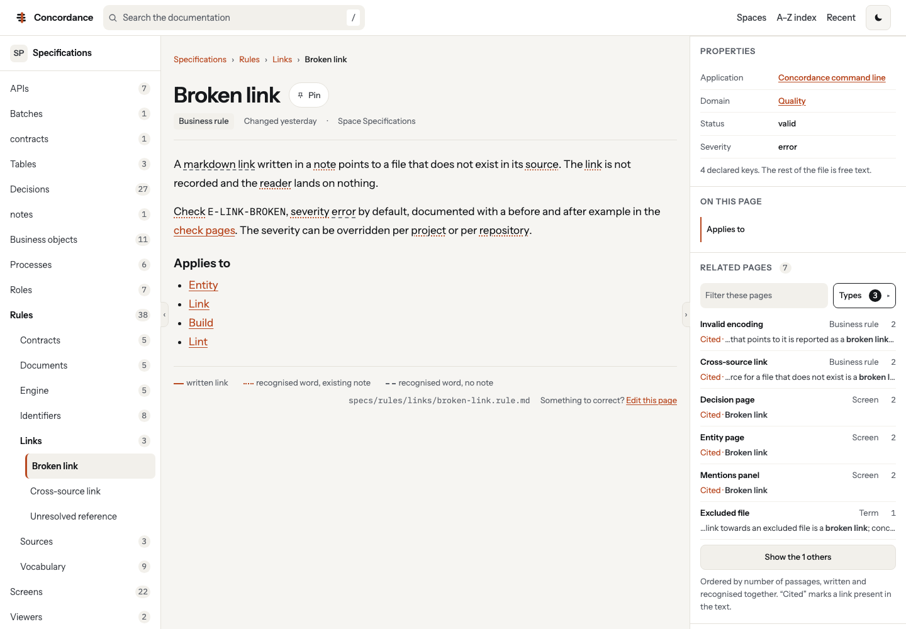

<p align="center">
  <picture>
    <source media="(prefers-color-scheme: dark)" srcset="brand/concordance-mark-light.svg">
    
  </picture>
</p>

<h1 align="center">Concordance</h1>

<p align="center"><strong>What your files already know about each other.</strong></p>

<p align="center">
  Your team writes markdown for the AI. Concordance turns it into a wiki for the humans.<br>
  Point it at your git repositories and get a site where every word of your business has a page.
</p>

<p align="center">
  <a href="https://www.npmjs.com/package/@concordance-wiki/concordance"></a>
  <a href="https://github.com/concordance-wiki/concordance/actions/workflows/ci.yml"></a>
  <a href="LICENSE"></a>
</p>

<p align="center">
  <a href="docs/guides/getting-started.md">Getting started</a> ·
  <a href="docs/guides/writing-notes.md">Writing notes</a> ·
  <a href="docs/guides/configuration.md">Configuration</a> ·
  <a href="docs/checks/README.md">Checks</a> ·
  <a href="docs/spec/mvp.md">Specification</a> ·
  <a href="CONTRIBUTING.md">Contributing</a>
</p>

---

## The problem

We now spend our days structuring knowledge for assistants: transcripts, specifications, glossaries, decisions, all in markdown, all in git. The AI reads it fine. We don't. It is scattered across repositories, nobody reads it twice, and nothing tells you that the term defined in the glossary is used in two hundred files, or that a decision taken in a meeting affects three screens.

Concordance takes those repositories **exactly as they are** and builds a wiki where every word your business uses has a page: the note someone wrote, if any, and every passage, in every file, that mentions it.

<p align="center">
  <picture>
    <source media="(prefers-color-scheme: dark)" srcset="docs/assets/screenshot-entity-dark.png">
    
  </picture>
</p>

No rewriting. No wikilinks. No frontmatter required. No server to run.

## One command

Turnkey with Docker:

```bash
docker run --rm -v "$PWD:/wiki" concordancewiki/concordance build
```

Or in a pipeline, with the CLI:

```bash
npx @concordance-wiki/concordance build      # clones your repositories, builds dist/, publish it anywhere
npx @concordance-wiki/concordance lint       # checks one repository before you push: broken links, duplicates, gaps
```

`dist/` is a static folder. Drop it on GitHub Pages, GitLab Pages or a bucket. It works over `file://` too.

## Zero configuration by default, structure when you want it

**Day one.** Declare your repositories, build. Concordance maps and aggregates everything: it finds the words people actually use, gives each one a page, links every file that mentions it, previews your Word, PowerPoint and PDF documents, makes transcripts readable, and shows you where the gaps are: words nobody defined, documents nobody summarised.

**When you want more.** Tell it that everything under `screens/` is a screen and every `.rule.md` is a rule. Add a few lines of frontmatter to a note. Write links between notes. Each step makes the wiki richer: typed pages, relations with their evidence, API contracts displayed next to the business. Nothing is ever required, and nothing you add stops working if you stop.

```yaml
# concordance.yaml — the whole configuration of a first wiki
version: 1
project: { name: My wiki }
sources:
  - name: glossary
    git: https://forge.example/knowledge/glossary.git
  - name: specs
    git: https://forge.example/knowledge/specs.git
```

## What you get

- **A page per word**, written or not, with every passage that uses it and a link to the source line.
- **Search that works without a server**, with facets by type, repository and domain.
- **Document previews**: Word, PowerPoint, PDF, VTT transcripts, reconciled with their markdown twins; transcripts are pseudonymised at build and published only on [explicit request](docs/guides/publishing-transcripts.md).
- **A to-do page**: words without a note, documents without markdown. The shortest path to a better corpus.
- **A linter for your CI**: broken links, duplicate identifiers, invalid frontmatter, undefined terms, annotated in the merge request.
- **Your brand**: name, logo, colours, light and dark. No mention of the tool unless you want one.
- **Evidence everywhere**: every link says where it comes from. Written links always beat inferred ones.

## Status

Version 0.1.x is published on npm: [`@concordance-wiki/concordance`](https://www.npmjs.com/package/@concordance-wiki/concordance), the command with every official plugin, and [`@concordance-wiki/cli`](https://www.npmjs.com/package/@concordance-wiki/cli), the command alone, with the [engine packages](packages/README.md) and the plugins next to them. The [demo wiki](https://concordance-wiki.github.io/demo-wiki/) is built from this project's own repositories, the [gallery](https://concordance-wiki.github.io/concordance/gallery/) shows every slot of the default theme in every state, and each version has its [release notes](https://github.com/concordance-wiki/concordance/releases) on GitHub.

The project's own wiki is built with Concordance from its [glossary](https://github.com/concordance-wiki/demo-glossary) and [specifications](https://github.com/concordance-wiki/demo-specs), configured by [demo-wiki](https://github.com/concordance-wiki/demo-wiki). Copy that repository to start yours.

## Going further

- [Getting started](docs/guides/getting-started.md): from an empty folder to a published site, in seven steps.
- [Writing notes](docs/guides/writing-notes.md): what a note is, what frontmatter adds, which sections mean something.
- [Configuration](docs/guides/configuration.md) and the [configuration reference](docs/reference/configuration.md): sources, typing rules, domains, thresholds, checks; every key, generated from the schema.
- [The command line](docs/guides/command-line.md): what each command reads, writes and returns.
- [Pipelines](docs/guides/pipelines.md): build and publish on GitHub Pages and GitLab Pages, lint in a merge request, copyable.
- [Operations](docs/guides/operations.md): build time and weight to expect, the cache, the container image, the human steps.
- [What the tool does not do](docs/guides/limits.md): the limits, one line each.
- [Publishing transcripts](docs/guides/publishing-transcripts.md): what the build hides, what it cannot decide, what to settle first.
- [Theming](docs/guides/theming.md): the slots of the site, their view models, overriding one from a plugin, rendering per type, the stylesheet layers.
- [Accessibility](docs/guides/accessibility.md): what is verified on every page, criterion by criterion, and what a theme author must keep.
- [Adding a type](docs/guides/adding-a-type.md): the type module format, a complete example, publishing a type in a plugin.
- [Distributing the linter](docs/guides/lint-distribution.md): `npx`, binary, GitHub action, GitLab component, container image, pre-commit hook.
- [Architecture](docs/guides/architecture.md): the decisions behind the tool, for contributors.
- [MVP specification](docs/spec/mvp.md): every feature, with its acceptance criteria.

The [documentation index](docs/README.md) lists every page.

## Contributing

Read [CONTRIBUTING.md](CONTRIBUTING.md) first. The bar is high on purpose: strict TypeScript, pure functions, full test coverage, deterministic output. Everyone taking part follows the [code of conduct](CODE_OF_CONDUCT.md). Security reports go through [SECURITY.md](SECURITY.md); releases follow the [release guide](docs/guides/releasing.md).

## Licence

[GNU General Public License, version 3 or later](LICENSE), for every package of this repository. The [licence inventory](docs/licenses.md) lists the third-party dependencies and their licences.
